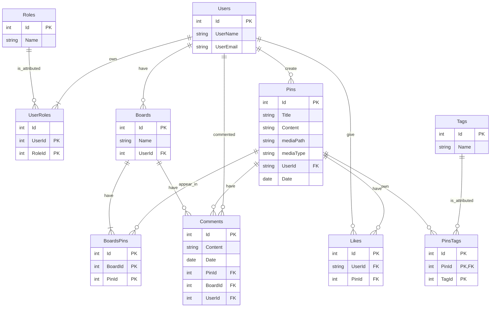

# SaveIt
## Database Diagram ##

# Elemente de organizare

Proiectul a fost început cu un meeting de organizare, pe data de 18
noiembrie 2023, în care am discutat elementele de concept. De asemenea,
tot atunci ne-am creat conturi de Trello, conform datelor indicate in
*Progres Proiect 1*.

Ulterior, pentru a facilita munca în echipă și pentru a beneficia de
funcții de *Version Control* (pentru a putea restaura versiuni mai vechi
ale aplicației în cazul erorilor, etc.), am creat un repository pe
GitHub. De asemenea, acesta ne permite și să păstrăm documentația (în
format MarkDown) împreună cu proiectul pentru portofoliul personal.

Au urmat numeroase meeting-uri, ce ne-au permis să comunicăm eficient și
să dezbatem cerințele complexe, pentru a găsi soluții corecte. Datorită
riscurilor de Merge Conflict în dezvoltarea incipientă a proiectului,
majoritatea codului a fost realizat în cadrul acestor întâlniri.
Ulterior, funcționalitățile prezente în View-urile și Controller-ele
asociate, au fost implementate de la distanță.

Astfel, alocarea sarcinilor de lucru a fost:

**Vlad**:

-   Relația many-to-many a Pin-urilor cu Tag-urile

-   Comentarii, Tag-uri, Board-uri

-   Useri si roluri

-   Afisarea paginata si Search Bar

**Radu**:

-   Funcția de vot

-   Design-ul aplicației

-   Implementarea elementelor media

-   Comentariile asociate boardurilor

Distribuția echilibrată a sarcinilor de lucru se poate observa și din
statisticile contribuțiilor de pe GitHub:


Un pas crucial în dezvoltarea proiectului a fost realizarea diagramei
pentru baza de date. Acest lucru ne-a permis să creăm modelele într-un
mod corect de la bun început și să implementăm cu ușirință relațiile.



Inițial ne-am propus ca până la prezentarea intermediară să avem puțin
peste jumătate din cerințe acoperite. Totuși, valorificând munca în
echipă, am reușit să realizăm aproximativ 90% din cerințe, precum și
câteva functionalități extra la care ne-am gândit. De asemenea, nu am
neglijat nici partea de design, încercând să facem aplicația
user-friendly și să oferim un User Experience plăcut. Apoi, am continuat
dezvoltarea aplicației cu restul task-urilor introduse in Trello.


Un impediment a constat în rezolvarea unor merge conflicts, în momentul
în care modificam anumite aspecte din același fișier. Totuși, comunicând
eficient chiar și la distanță, am reușit să găsim soluții și pentru
acestea.


Alte elemente care au reprezentat impedimente temporare și pe care a
trebuit să le dezbatem au fost, printre altele: implementarea funcției
*like*, introducerea tag-urilor many-to-many, verificarea exclusivității
elementului media.

# Elemente de complexitate tratate in proiect

Proiectul *SaveIt*, ilustrează toate funcționalitățile precizate în
specificația proiectului, dar are în plus și unele adăugiri (inclusiv
față de modelul *Pinterest*, precum posibilitatea de a adăuga comentarii
pentru Boarduri).

Un element extra interesant este constituit de posibilitatea de a adăuga
tag-uri postărilor (format Many-To-Many, similar modelului *Pinterest*).
Pentru a realiza acest lucru, am avut nevoie de un dropdown cu select
multiplu. Totuși, cel clasic, oferit de *HTML*, necesita ca Userul sa
folosească tasta Ctrl pentru a selecta mai multe opțiuni, lucru
neintuitiv și care oferea un UX neplăcut. Astfel, am integrat *Select2*,
o alternativă ce folosește *jQuery* pentru a face toată experiența mult
mai simplă și plăcută.

``` html
<label>Selectati Tag-urile</label>
        @Html.DropDownListFor(m => m.TagIds, new SelectList(
        Model.Tags, "Value", "Text"), "Selectati Tag-ul", new { 
        @class = "form-select", multiple="multiple", id="multiple-
        select-field", data_placeholder="Alege Tag-urile" })
        @Html.ValidationMessageFor(m => m.TagIds, null, new { 
        @class = "text-danger" })
        <br /> <br />

<link rel="stylesheet" href="https://cdn.jsdelivr.net/npm/select2@4.0.13
/dist/css/select2.min.css" />
    <link rel="stylesheet" href="https://cdn.jsdelivr.net/npm/select2-
    bootstrap-5-theme@1.3.0/dist/select2-bootstrap-5-theme.min.css" />

<script src="https://cdn.jsdelivr.net/npm/jquery@3.5.0/dist/jquery.slim.
min.js"></script>
    <script src="https://cdn.jsdelivr.net/npm/bootstrap@5.1.3/dist/js/
bootstrap.bundle.min.js"></script>
    <script src="https://cdn.jsdelivr.net/npm/select2@4.0.13/dist/js/select2.
full.min.js"></script>
```

``` javascript
    $('#multiple-select-field').select2({
    theme: "bootstrap-5",
    width: $(this).data('width') ? $(this).data('width') : $(this).
        hasClass('w-100') ? '100%' : 'style',
    placeholder: $(this).data('placeholder'),
    closeOnSelect: false,
});
```


Un alt element complex, tratat în proiect, constă în validarea și
posibilitatea de editare pentru formularele care conțin elemente media.
Astfel, este obligatorie adăugarea unui element media (fie imagine, fie
videoclip embeded), dar nu se pot adăuga ambele în același timp
(validarea realizată în controller).

``` csharp
if (PinPhoto != null)
{
    if (pin.mediaPath != requestPin.mediaPath)
    {
        pin.Tags = GetAllTags();
        ModelState.AddModelError("mediaPath", 
        "Nu puteti adauga o imagine si un link " +
                                       "pentru video in acelasi timp!");
        return View(pin);
    }
    var fileName = Path.GetFileName(PinPhoto.FileName);
    var filePath = Path.Combine(Directory.GetCurrentDirectory(),
        "wwwroot\\images", fileName);
    using (var fileSteam = new FileStream(filePath, FileMode.Create))
    {
        await PinPhoto.CopyToAsync(fileSteam);
    }
    pin.mediaType = "image";
    pin.mediaPath = fileName;
}
else if (requestPin.mediaPath != null)
{
    pin.mediaType = "video";
    pin.mediaPath = requestPin.mediaPath;
}
else
{
    pin.Tags = GetAllTags();
    ModelState.AddModelError("mediaPath", 
        "Trebuie sa adaugati o imagine sau un link pentru video!");
    return View(pin);
} 
```


De asemenea, în formularul de editare se oferă un preview pentru
elementul media deja existent în baza de date. Se poate modifica
inclusiv tipul de element media utilizat.

``` html
@Html.Label("Media preview: ", "Fisier media curent")
@if (Model.mediaType == "image")
{
    
}
else
{
    <iframe width="420" height="315" src="@Model.mediaPath"> </iframe>
}
```

