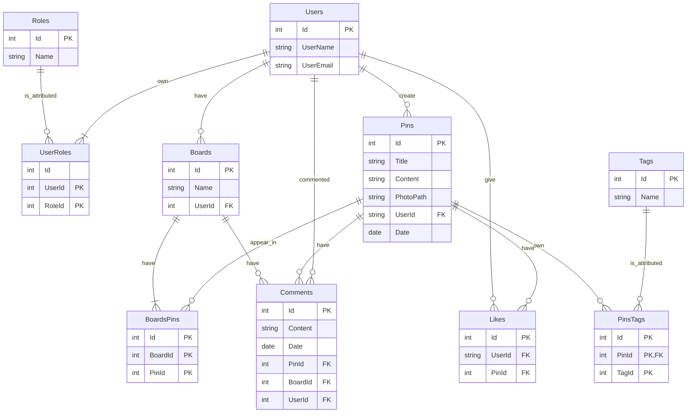

# SaveIt
## Database Diagram ##

```mermaid
erDiagram
    Roles ||--o{ UserRoles : is_attributed
    Roles {
        int Id PK
        string Name
    }
    
    Users ||--|{ UserRoles : own
    Users ||--o{ Boards : have
    Users ||--o{ Likes : give
    Users {
        int Id PK
        string UserName
        string UserEmail
    }
    Likes {
        int Id  PK
        string UserId FK
        int PinId FK
    }
    Users ||--o{ Pins : create
    
    UserRoles {
        int Id
        int UserId PK
        int RoleId PK
    }
    Boards ||--|{ BoardsPins : have
    Boards ||--o{ Comments : have
    Pins ||--o{ Comments : have
    Users ||--o{Comments : commented

    Comments {
        int Id PK
        string Content
        date Date
        int PinId FK
        int BoardId FK
        int UserId FK
    }
    

    Boards {
        int Id PK
        string Name
        int UserId FK
    }
    
    
    Pins ||--o{ PinsTags : own
    Pins ||--o{ BoardsPins : appear_in
    Pins ||--o{ Likes : have
    Pins {
        int Id PK
        string Title
        string Content
        string PhotoPath
        string UserId FK
        date Date
    }
    
    
    PinsTags {
        int Id PK
        int PinId PK, FK
        int TagId PK
    }
    BoardsPins {
        int Id PK
        int BoardId PK
        int PinId PK
    }

    Tags ||--o{ PinsTags : is_attributed
    Tags {
        int Id PK
        string Name
    }
```
