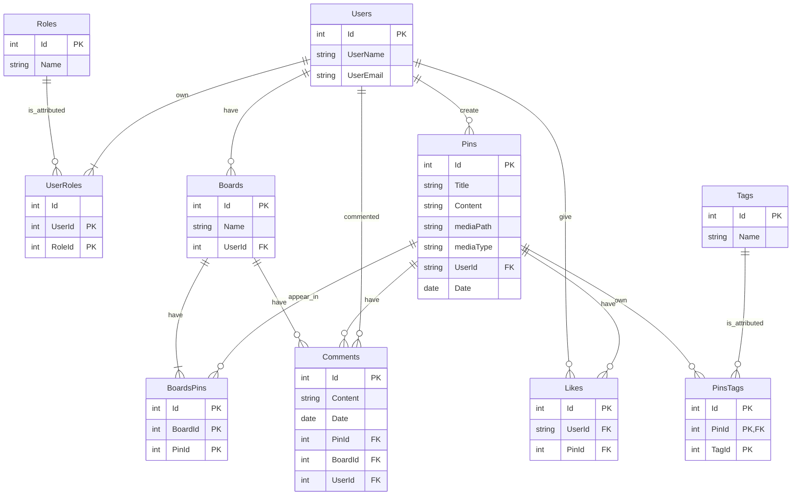

# SaveIt

## Description ##

Social Bookmarking website that allows users to do CRUD operations on posts. Posts can be organized in Boards. Each post can contain text content, uploaded pictures/embedded videos and multiple tags.
It features a login system, having 3 types of users:
* Unregistered: can see all the posts on the website
* Registered User: can create new posts and can leave comments, as well as edit their own content. They can also create their own boards with selected posts.
* Admin: can edit all content on the website.

Registered users can like other posts, in order to constantly recommend the most liked posts. They also have access to a search bar, in addition to pagination for posts, for an easier navigation through the platform.

## Technologies ## 

* ASP.NET Core, C#
* Razor
* Microsoft SQL Server
* Bootstrap
* jQuery

## Database Diagram ##

